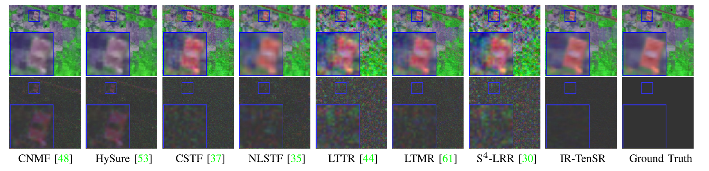

# An Iterative Regularization Method based on Tensor Subspace Representation for Hyperspectral Image Super-Resolution 

**Homepage:** https://liangjiandeng.github.io/ and https://tingxu113.github.io/

# How to use?
- Directly run: ``Demo.m`` 

 
# Citation
```bibtex
@ARTICLE{xu2022tgrs,
author={T. Xu, T.-Z. Huang, L.-J. Deng, and N. Yokoya},
booktitle={IEEE Trans. Geosci. Remote Sens.},
title={An Iterative Regularization Method based on Tensor Subspace Representation for Hyperspectral Image Super-Resolution},
year={2022},
pages={},
}
```


# Method

***Motivation:*** Statistical analysis of low tensor tubal rank on seven HR-HSIs (the same color represents the same dataset). (a)–(f) Normalized tensor singular value curve of original HR-HSI and five permuted HR-HSIs, respectively.


(a) Diagram of TenSR and MatSR. (b) HSI-SR results by using TenSR and MatSR with different subspace dimensions. 


 The spatial–spectral nonlocal self-similarity property of the tensor coefficient.


***Overall Framework:*** The framework of our model. The details of our framework can be found in Sect. III.


***Final Model:*** 


***Iterative Regularization Algorithm:*** 


***Visual Results:*** HSI-SR results of Indian Pines. The first and second rows present the results consisting of 11th, 48th, and 128th band of the fused images under
SNR = 15 dB and the corresponding error maps, respectively. The blue block shows the representation region.




***Quantitative Results:*** Quantitative evaluation of different methods on Indian Pines dataset with four noise cases


